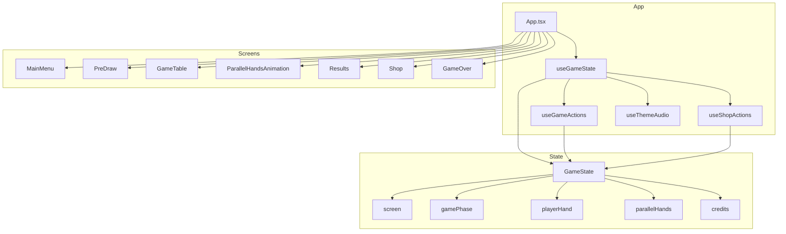
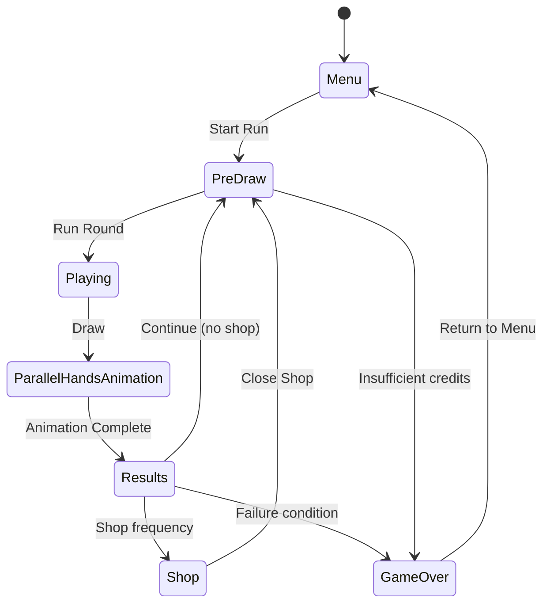
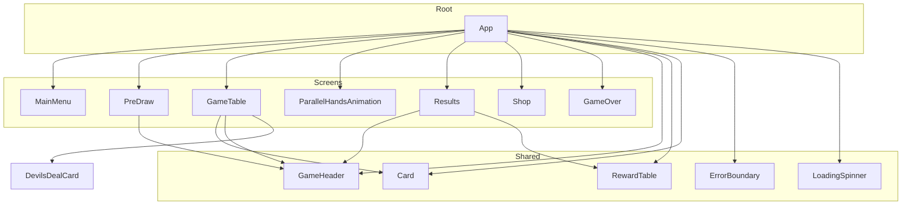
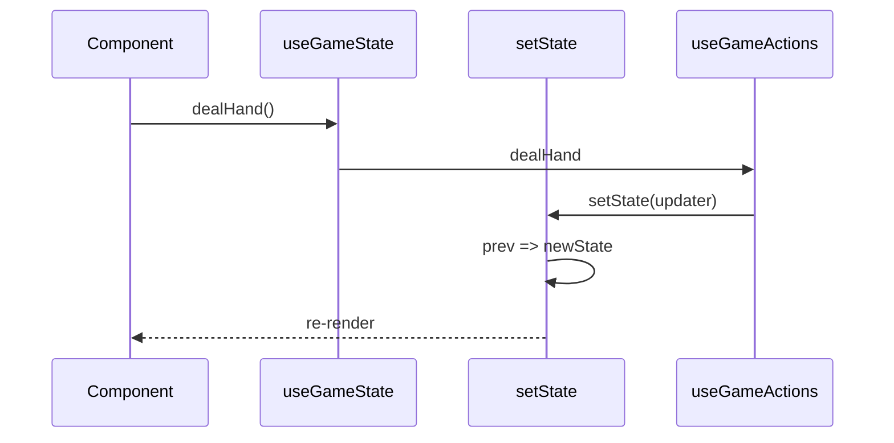

# Architecture Diagrams

## State Flow

```mermaid
flowchart TD
    subgraph App
        A[App.tsx] --> B[useGameState]
        B --> C[useGameActions]
        B --> D[useShopActions]
        B --> E[useThemeAudio]
    end

    subgraph Screens
        A --> F[MainMenu]
        A --> G[PreDraw]
        A --> H[GameTable]
        A --> I[ParallelHandsAnimation]
        A --> J[Results]
        A --> K[Shop]
        A --> L[GameOver]
    end

    subgraph State
        B --> M[GameState]
        M --> N[screen]
        M --> O[gamePhase]
        M --> P[playerHand]
        M --> Q[parallelHands]
        M --> R[credits]
    end

    C --> M
    D --> M
```

## Game Flow

```mermaid
stateDiagram-v2
    [*] --> Menu
    Menu --> PreDraw: Start Run
    PreDraw --> Playing: Run Round
    Playing --> ParallelHandsAnimation: Draw
    ParallelHandsAnimation --> Results: Animation Complete
    Results --> PreDraw: Continue (no shop)
    Results --> Shop: Shop frequency
    Shop --> PreDraw: Close Shop
    Results --> GameOver: Failure condition
    PreDraw --> GameOver: Insufficient credits
    GameOver --> Menu: Return to Menu
```

## Component Hierarchy

```mermaid
flowchart TB
    subgraph Root
        App
    end

    subgraph Screens
        App --> MainMenu
        App --> PreDraw
        App --> GameTable
        App --> ParallelHandsAnimation
        App --> Results
        App --> Shop
        App --> GameOver
    end

    subgraph Shared
        App --> GameHeader
        App --> RewardTable
        App --> Card
        App --> ErrorBoundary
        App --> LoadingSpinner
    end

    GameTable --> Card
    GameTable --> GameHeader
    GameTable --> DevilsDealCard
    PreDraw --> GameHeader
    Results --> GameHeader
    Results --> RewardTable
```

## State Update Pattern

```mermaid
sequenceDiagram
    participant Component
    participant useGameState
    participant setState
    participant useGameActions

    Component->>useGameState: dealHand()
    useGameState->>useGameActions: dealHand
    useGameActions->>setState: setState(updater)
    setState->>setState: prev => newState
    setState-->>Component: re-render
```
